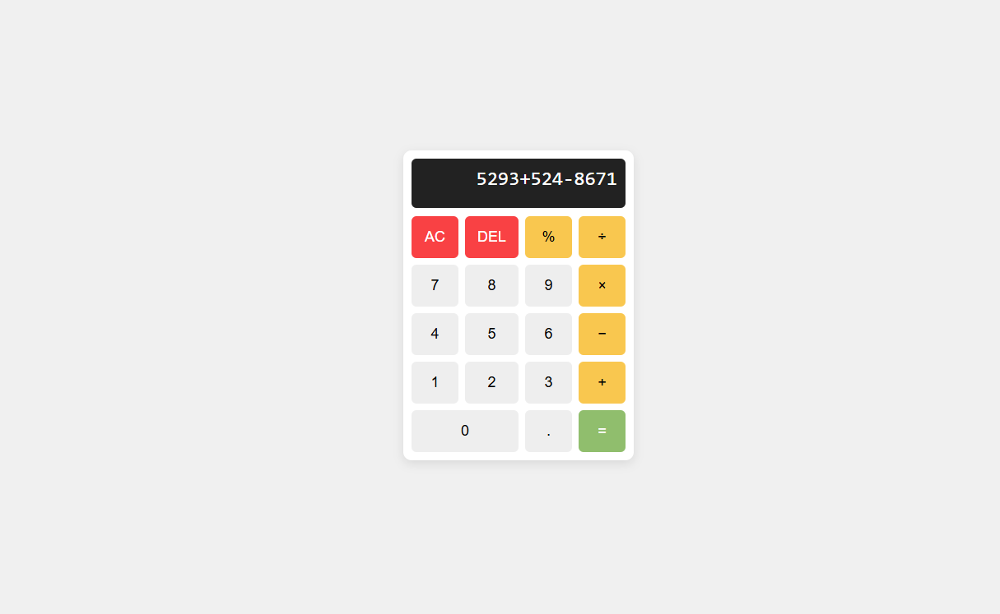

# Simple Web Calculator

A clean and minimal **calculator web app** built with **HTML, CSS, and JavaScript**.  
It supports basic arithmetic operations: addition, subtraction, multiplication, division, percentages, and decimals.

---

## Preview

---

## Features
- Responsive layout with a modern card-like design
- Basic operations (`+`, `-`, `×`, `÷`, `%`)
- Clear All (`AC`) and Delete (`DEL`)
- Handles multi-digit numbers and decimals
- Displays errors for invalid inputs
- Simple, lightweight — no external libraries

---

## How to Use
1. Clone or download this repository.
2. Place all files in the same folder.
3. Open the `index.html` file in your browser.
4. Start calculating!

---

## Code Highlights
- **HTML**: Provides structure for the calculator screen and buttons.
- **CSS**: Styled with Flexbox and CSS Grid for a neat keypad layout.
- **JavaScript**: 
  - `append(val)` → Adds digits/operators  
  - `clearAll()` → Clears the display  
  - `del()` → Removes last character  
  - `compute()` → Evaluates the expression using the `Function` constructor

---
