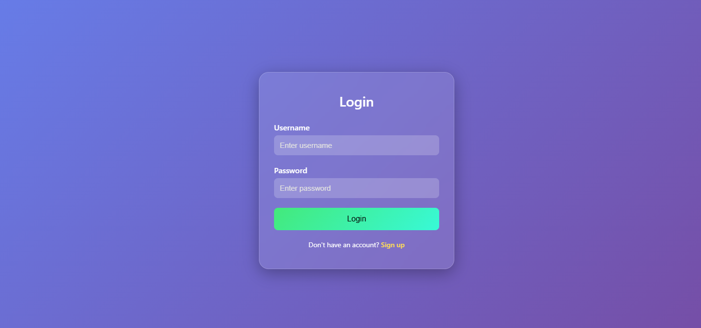

# Login Page  

A modern and minimal login page built using **HTML** and **CSS**. The page features a clean UI with a gradient background, a centered login card, and an appealing design suitable for any web application.  

## Features  

- Fully responsive design  
- Gradient background with subtle shadow effects  
- Input fields for **username** and **password**  
- Styled login button with hover effects  
- "Sign up" link for new users  

## Technologies Used  

- **HTML5**  
- **CSS3** (Flexbox, Gradient, Shadows)

