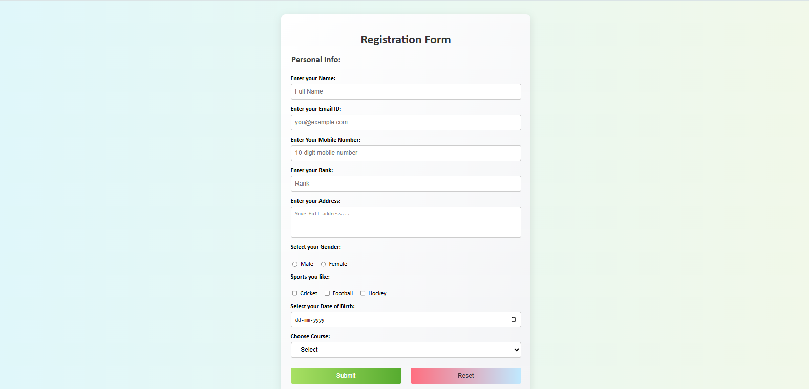

#  Registration Form

A responsive and visually appealing registration form built using **HTML** and **CSS**. This form collects essential user information including name, contact details, gender, interests, date of birth, and selected course.

## Features

- Clean and modern UI
- Fully responsive design
- User-friendly input fields
- Gender selection via radio buttons
- Sports preferences using checkboxes
- Date picker for selecting Date of Birth
- Dropdown menu for course selection
- Submit and Reset buttons with custom styling

## Preview

 <!-- Replace with actual screenshot file if hosted -->

##  Technologies Used

- **HTML5**
- **CSS3**

